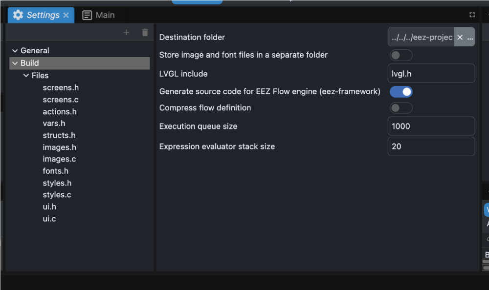

# Sample Arduino project for JC3636W518EN display with EEZ-Studio

This project connects EEZ-Studio development software with Arduino IDE 

## Instructions

**This project uses library**

lvgl@8.3.11
ESP32_Display_Panel@0.2.1
ESP32_IO_Expander@0.1.0

* [ ] Use this settings in Arduino IDE

* [ ] Use this settings in EEZ-Studio

* [ ] Setup destination folder in project [src] subfolder !!!

* [ ] Change import of "lvgl/lvgl.h" to "lvgl.h"
